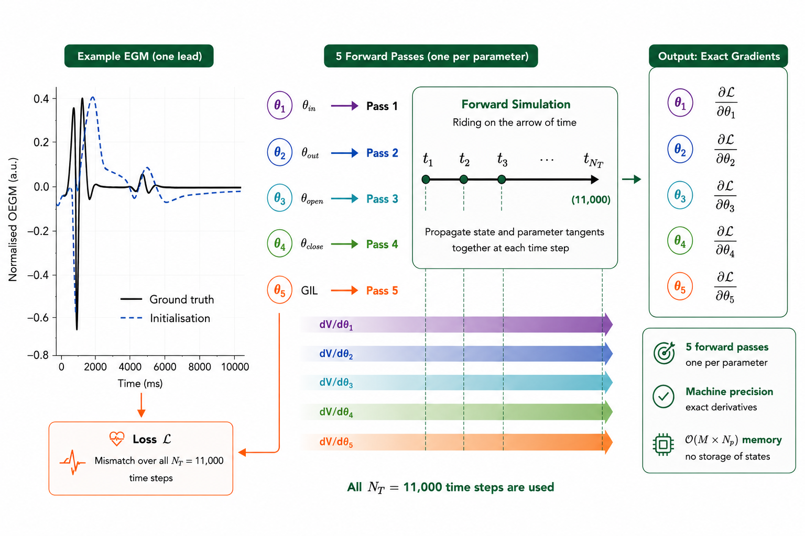
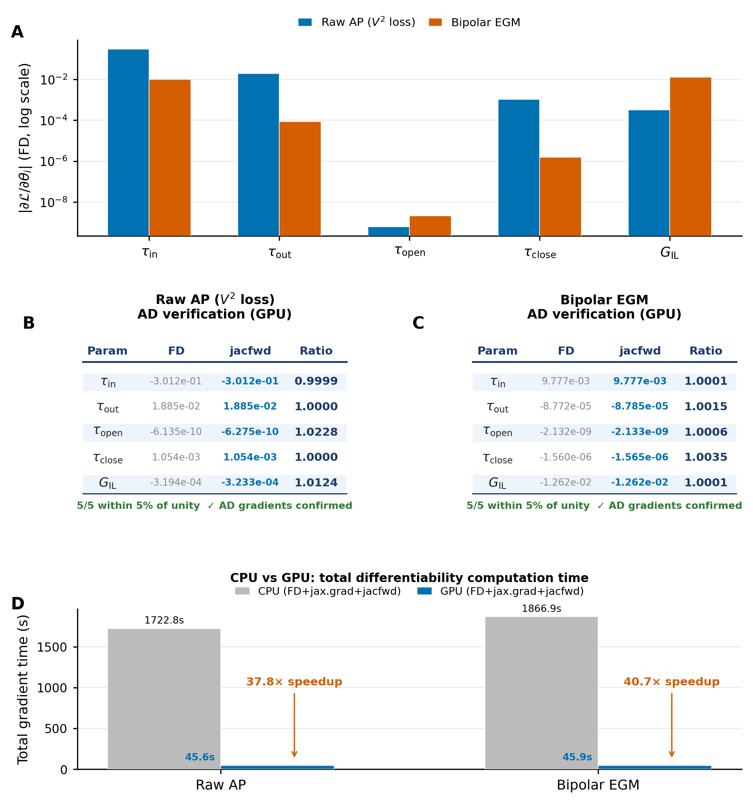
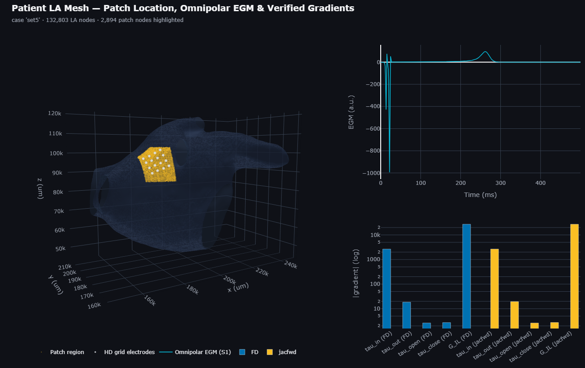
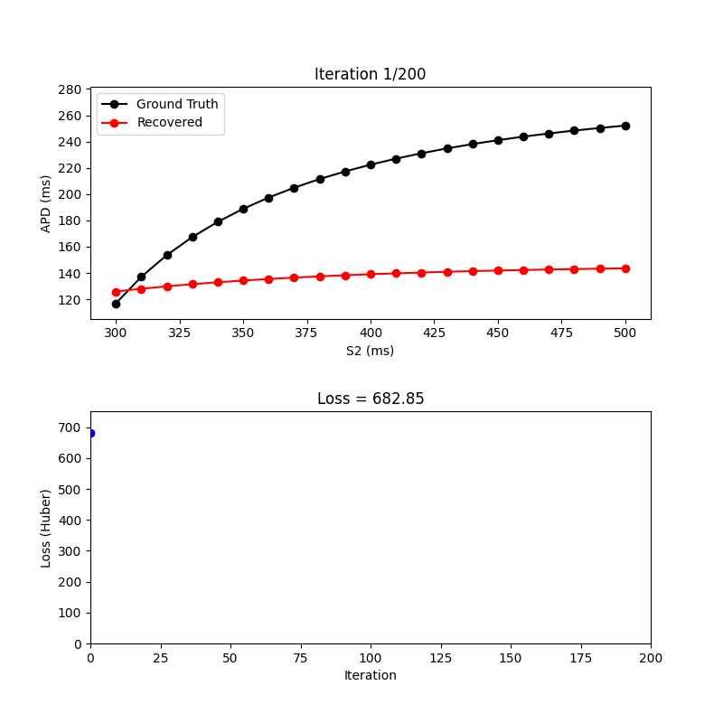

# JAX-EP: Differentiable Cardiac Electrophysiology Framework
JAX-EP is a fully differentiable cardiac EP solver and parameter-inversion framework built in JAX [1], enabling GPU-accelerated monodomain simulations and gradient-based inference of personalised tissue and cellular EP parameters. This folder contains the JAX-EP parameter-learning pipeline: recovering five cell-kinetics and conductivity parameters from simulated omnipolar electrograms (EGMs). The codebase progresses systematically from cellular-level validation through full left-atrial (LA) forward simulation to parameter learning on a full 3D LA manifold.

## About JAX-EP

This README communicates structural, mathematical, and execution information about the JAX-EP project. It serves as the primary technical documentation for repository visitors and contributors.

The repository is organized into four interconnected core components:

* **0D Cellular Validation**: Verification of the JAX-based modified Mitchell-Schaeffer (mMS) [1] single-cell EP formulation  against an independent openCARP reference trace to ensure core algorithmic and differentiability consistency.
* **2D Spatial Validation**: Combined evaluation of the discrete spatial diffusion solver alongside localized ionic kinetics, benchmarked directly via conduction velocity profiles on an idealized 2D flat plate geometry.
* **Fully Differentiable Monodomain Solver**: Anisotropic Finite Element Method (FEM) propagation mechanics compiled via `jax.jit` and accelerated on modern GPU architectures, showcased through high-performance Left Atrial (LA) forward simulations.
* **Parameter Inversion Pipeline**: Benefiting from the differentiability of the JAX-EP monodomain solver, a dual-phase optimization pipeline combining multi-stage Nelder–Mead optimization with localized finite-difference L-BFGS-B refinement was developed to recover five cellular-kinetic and conductivity parameters from clinically motivated omnipolar electrograms (EGMs).


---



JAX-EP brings scalable GPU-accelerated cardiac monodomain modelling to gradient-based parameter learning, exposing gradients of EP model outputs with respect to model parameters. It achieves:
1. **Accelerated Forward Models**: Over 50x GPU-to-CPU simulation speedups using Custom Crank-Nicolson solver [4] and `jax.jit`.
2. **Stable Gradients**: Leverages forward-mode automatic differentiation (`jax.jacfwd`) and gradient checkpointing (`jax.checkpoint`) to navigate stiff, long-time ionic chains.
3. **Automated Parameter Optimization**: Blindly recovers hidden physiological settings using a multi-stage curriculum.

---

## Why the Project is Useful

Traditional cardiac solvers lack efficient, native integration with machine learning or modern optimization tooling. By implementing the physics graph entirely within JAX, this framework allows researchers to:
* Perform high-throughput forward simulations on modern GPU hardware.
* Execute exact parameter estimation without relying on manual trial-and-error tuning curves.
* Maintain complete data tracking under strict blind optimization protocols.

---

## How Users Can Get Started

All code blocks run out of a single integrated Python setup. Use the instructions below to configure and run the simulation suite.

### 1. Conda Environment Setup
Navigate to your project root folder and build the environment using the provided commands:

```bash
# Move to repository root
cd path_to_dir\Github_repo

# Create and activate environment
conda create --name jax_env python=3.10 -y
conda activate jax_env

# Install package dependencies
pip install -r requirements.txt
```

### 2. Relative Directory Paths and Execution
Each component runs independently from within its own local subdirectory. Always ensure your environment is active before running scripts:

* **To run JAX-EP solver validation against carpentry bench (0D trace) and CARP 2D reference simulation [3]:**
  ```bash
  cd benchmark/0D_validation/
  python 0D_differentiable_validation.py
  ```
  ```bash
  cd benchmark/2D_validation/
  python benchmark2D.py
  ```
* **To run LA tissue sample (3D cube) using JAX-EP solver and compare CPU/GPU performance (forward simulations):**
  ```bash
  cd forward_model/
  python run_forward.py
  python run_cpu_gpu_comparison.py
  ```
* **To evaluate gradients using JAX-EP end-to-end differentiable simulations, i.e. $\partial\mathcal{L}/\partial\theta$:**
  ```bash
  cd differentiability/3D_cube
  python run_differentiability_cpu_gpu.py

  cd differentiability/LA_patch
  python patch_differentiability_showcase.py
  ```
* **To learn parameters from omnipolar EGM recordings**
  ```bash
  cd parameter_learning
  python parameter_learning_patch_geometry.py
  ```
---

### 3. Technical Specifications and Performance of JAX-EP forward solver 

### MRI derived Patient Specific Left atrial (LA) Forward Simulation Performance (NVIDIA Tesla T4)
* **CS Pacing Forward:** 46.2s GPU vs. 2608.2s CPU (**56x Speedup**)
* **LAA Pacing Forward:** 46.8s GPU vs. 2738.6s CPU (**58x Speedup**)
* **Full Jacobian Matrix ($dAT/dG_{IL}$):** 90.4s GPU vs. 5096.2s CPU (**56x Speedup**)

### 3D Tissue-Sample Cube Forward Performance (NVIDIA Tesla P100)
To ensure a comparable test with similar spatial and temporal resolution as compared to the patient LA mesh (dx = 0.351mm median edge length, DT = 0.1ms), the cube uses dx = 0.2mm and DT = 0.1ms with N_T = 11,100 timesteps
* **Forward Simulation:** 57.7s CPU vs. 1.34s GPU (**43× Speedup**)
* **Activation Map:** Identical CPU and GPU activation patterns
* **Maximum |AT Difference|:** 0.000 ms

<table>
  <tr>
    <th>Metric</th>
    <th>CPU</th>
    <th>GPU</th>
    <th>GPU Speed-up</th>
  </tr>
  <tr>
    <td><b>Forward simulation</b></td>
    <td>57.732 s</td>
    <td><b>1.342 s</b></td>
    <td><b>43.0×</b></td>
  </tr>
  <tr>
    <td>Activated nodes</td>
    <td>18,432</td>
    <td>18,432</td>
    <td>—</td>
  </tr>
  <tr>
    <td>Activation-time range</td>
    <td>13.10–54.40 ms</td>
    <td>13.10–54.40 ms</td>
    <td>—</td>
  </tr>
  <tr>
    <td>Activation map agreement</td>
    <td>—</td>
    <td><b>Identical</b></td>
    <td><b>0.000 ms</b> max difference</td>
  </tr>
</table>

The GPU reduced the forward simulation time by **43×** while producing an activation map numerically identical to the CPU implementation.

## Solver Differentiability

A central feature of JAX-EP is its end-to-end differentiability, allowing gradients to be propagated through the complete cardiac electrophysiology simulation pipeline. This enables derivatives of simulated electrophysiological observables with respect to cellular and tissue parameters, providing the basis for gradient-based parameter inference and personalised electrophysiological model calibration.



Above differentiability results can be reproduced using `run_differentiability_cpu_gpu.py`, which uses a 3D cube representative of the full LA simulation, with matching spatial and temporal resolutions. The example uses a 3D tissue cube comprising **18,432 nodes and 36,860 elements**, with a spatial resolution of `dx = 0.2 mm`, a time step of `DT = 0.1 ms`, and `N_T = 11,100` time steps (total simulation time: 1110 ms). The script compares finite-difference (FD) gradients with reverse-mode (`jax.grad`) and forward-mode (`jax.jacfwd`) automatic differentiation, and includes the corresponding CPU/GPU benchmark.

### Forward-Mode Autodiff

For the tested ionic parameters (`tau_in`, `tau_out`, `tau_open`, `tau_close`) and longitudinal intracellular conductivity (`G_IL`), `jax.jacfwd` reproduced the finite-difference gradients with excellent agreement:

| Parameter | FD Gradient | `jax.jacfwd` | Ratio |
| :--- | ---: | ---: | ---: |
| `tau_in` | -3.0118e-01 | -3.0116e-01 | 0.9999 |
| `tau_out` | 1.8851e-02 | 1.8851e-02 | 1.0000 |
| `tau_open` | -6.1344e-10 | -6.2751e-10 | 1.0229 |
| `tau_close` | 1.0544e-03 | 1.0544e-03 | 1.0000 |
| `G_IL` | -3.1939e-04 | -3.2335e-04 | 1.0124 |

The forward-mode derivatives were stable across all tested parameters, with the largest deviation from the finite-difference reference of approximately **2.3%**. These gradient comparisons can be reproduced and visualised using `plot_gradients.py`.

### Reverse-Mode Autodiff

In contrast, direct reverse-mode differentiation using `jax.grad` produced severe gradient amplification for the stiff ionic dynamics. The resulting derivatives differed from the finite-difference reference by several orders of magnitude, making the gradients unsuitable for stable parameter optimization in this configuration.

This behaviour was observed consistently across both CPU and GPU executions, indicating that the issue originates from the differentiation of the stiff ionic time integration rather than the computational device.

### Differentiable Electrogram Generation

The differentiability extends beyond the transmembrane voltage state to derived electrophysiological observables. A bipolar EGM configuration using two spatially separated electrode regions (0.3 mm inter electrode gap) was included in the benchmark. Forward-mode differentiation again reproduced the finite-difference gradients with close agreement, including for `G_IL`.

| Parameter | FD Gradient | `jax.jacfwd` | Ratio |
| :--- | ---: | ---: | ---: |
| `tau_in` | 9.7765e-03 | 9.7775e-03 | 1.0001 |
| `tau_out` | -8.7719e-05 | -8.7848e-05 | 1.0015 |
| `tau_open` | -2.1321e-09 | -2.1333e-09 | 1.0006 |
| `tau_close` | -1.5596e-06 | -1.5651e-06 | 1.0035 |
| `G_IL` | -1.2619e-02 | -1.2620e-02 | 1.0001 |

The bipolar EGM benchmark therefore provides an independent demonstration that gradients can be propagated through the simulation and EGM generation pipeline.

### CPU/GPU Differentiability Performance

The differentiability benchmark also demonstrates the computational advantage of JAX-EP on GPU hardware. For the complete FD, `jax.grad`, and `jax.jacfwd` benchmark:

| Benchmark | CPU | GPU | GPU Speed-up |
| :--- | ---: | ---: | ---: |
| Raw voltage (`V²` loss) | 1722.8 s | 45.6 s | **37.8×** |
| Bipolar EGM | 1866.9 s | 45.9 s | **40.7×** |

The GPU implementation therefore provides approximately **38–41× acceleration** for the differentiability benchmark while retaining agreement with the reference finite-difference gradients.

### Patient-Specific LA Patch Differentiability

The differentiability workflow was also tested on a representative patch extracted from the **patient-specific MRI-derived LA anatomy** used for the HD-grid omnipolar EGM simulations. The extracted patch contains **2,894 nodes and 5,572 elements** and retains the same spatial and temporal discretisation used in the full LA simulation. The patch also includes the HD-grid electrode geometry and fibre information required to generate the simulated omnipolar EGMs.

The complete test can be reproduced using `patch_differentiability_showcase.py` with the provided `patch_geometry.npz`. The script generates the ground-truth omnipolar EGMs and compares finite-difference (FD), reverse-mode (`jax.grad`), and forward-mode (`jax.jacfwd`) derivatives for the five model parameters: `tau_in`, `tau_out`, `tau_open`, `tau_close`, and `G_IL`.

For the representative `set3` case, `jax.jacfwd` remained stable for all five parameters and closely matched the FD reference:

| Parameter | FD Gradient | `jax.jacfwd` | Ratio |
| :--- | ---: | ---: | ---: |
| `tau_in` | -2.6556e+03 | -2.6730e+03 | 1.0066 |
| `tau_out` | 1.8406e+01 | 1.9386e+01 | 1.0533 |
| `tau_open` | 2.6224e+00 | 2.6142e+00 | 0.9969 |
| `tau_close` | 2.7259e+00 | 2.7538e+00 | 1.0103 |
| `G_IL` | -2.7231e+04 | -2.7209e+04 | 0.9992 |

Forward-mode derivatives agreed closely with the FD reference across all five parameters with mean absolute deviation ~1.5%, maximum ~5.3%. Both of these were found within the benchmark's stability criterion whereas reverse-mode jax.grad diverged from the FD reference by many orders of magnitude due to the stiff ionic dynamics

This example extends the differentiability test beyond the simplified 3D cube to a geometry **extracted directly from the patient-specific LA anatomy**, while retaining the simulated HD-grid omnipolar EGM generation pipeline. The patch test and outputs can be reproduced with `patch_differentiability_showcase.py`; the extracted geometry is provided as `patch_geometry.npz`.



Overall, these tests establish that JAX-EP provides a **fully differentiable cardiac EP simulation pipeline**, with forward-mode automatic differentiation providing stable gradients through the stiff ionic dynamics and derived EGM calculations. This differentiability forms the computational basis for the subsequent **gradient-based parameter-learning and personalised EP inference** framework.

### 4. Parameter Learning Framework 
### 0D Ionic Cellular Parameters: APD Restitution Recovery

Before performing spatially distributed parameter learning, JAX-EP was validated at the **0D cellular level** through blind recovery of the four modified Mitchell–Schaeffer kinetic parameters: `tau_in`, `tau_out`, `tau_open`, and `tau_close`.

The optimizer was provided only with the target **APD restitution curve** and did not have access to the ground-truth parameter values. Parameter recovery was performed using GPU-accelerated JAX automatic differentiation on an NVIDIA Tesla P100.

**Hardware:** NVIDIA Tesla P100-PCIE-16GB  
**Backend:** JAX / CUDA GPU  
**Optimization iterations:** 200

The optimization reduced the restitution loss from **682.85** initially to **0.0833**, producing an APD restitution curve that closely matched the ground truth.

#### APD Restitution Recovery

Representative points across the S2 restitution range are shown below. The complete restitution curve is generated by the reproducible 0D parameter-learning script.

<table>
  <tr>
    <td valign="top">

| S2 (ms) | APD GT (ms) | APD Rec. (ms) | Error (ms) | Error (%) |
| :---: | ---: | ---: | ---: | ---: |
| 500 | 252.158 | 252.753 | +0.595 | 0.24 |
| 470 | 246.147 | 246.539 | +0.392 | 0.16 |
| 430 | 234.754 | 234.834 | +0.079 | 0.03 |
| 400 | 222.398 | 222.227 | −0.171 | 0.08 |
| 370 | 204.872 | 204.488 | −0.384 | 0.19 |
| 340 | 178.869 | 178.465 | −0.404 | 0.23 |
| 320 | 153.567 | 153.496 | −0.072 | 0.05 |
| 300 | 116.855 | 117.951 | +1.096 | 0.94 |

</td>
<td valign="middle" align="center">



</td>
  </tr>
</table>

Across the complete restitution curve (**S2 = 300–500 ms**), the recovered model achieved a **mean absolute APD error of 0.337 ms (0.18%)**, with a maximum error of **1.096 ms (0.94%)**.

#### Parameter Recovery

Although the APD restitution curve was reproduced with high accuracy, the results also demonstrate an important property of inverse cellular modelling: **APD restitution alone does not uniquely constrain all ionic parameters**. In particular, `tau_in` and `tau_out` exhibited substantially different recovered values while producing an almost identical restitution curve.

| Parameter | Ground Truth | Recovered | Absolute Difference | Error (%) |
| :--- | ---: | ---: | ---: | ---: |
| `tau_in` | 0.3000 | 0.0658 | 0.2342 | 78.07 |
| `tau_out` | 6.0000 | 1.4182 | 4.5818 | 76.36 |
| `tau_open` | 120.0000 | 121.7327 | 1.7327 | 1.44 |
| `tau_close` | 150.0000 | 159.3775 | 9.3775 | 6.25 |

This 0D experiment therefore provides two complementary validations: **(i)** JAX-EP can differentiate through the cellular dynamics and recover parameters that strongly influence restitution behaviour, and **(ii)** matching APD restitution does not necessarily imply unique recovery of the underlying ionic parameters. This motivates the use of richer electrophysiological observables, including electrogram morphology and activation-related features, in the subsequent spatial parameter-learning framework.

The 0D parameter-learning experiment can be reproduced using the corresponding script in the `parameter_learning/` directory. The generated animation is saved as `0D_parameter_recovery.gif`.
### Parameter Learning Results (NVIDIA Tesla P100)

The parameter-learning pipeline recovers five cellular-kinetic and conductivity parameters: `tau_in`, `tau_out`, `tau_open`, `tau_close`, and `G_IL`  from simulated omnipolar EGMs, under a strict blind protocol: the ground-truth parameter values used to generate the target EGMs are never exposed to the optimizer, which sees only the resulting S1 and S2 electrogram signals.

Recovery proceeds in two stages. **Phase 1** uses a Nelder–Mead curriculum that progressively fits the S2 electrogram's mean-squared error and shape-derived features (activation time, slew rate, peak-to-peak amplitude, activation-recovery interval) across all nine cliques. **Phase 2** refines this fit using finite-difference-gradient L-BFGS-B on the combined S1+S2 mean-squared error.

* **Mean Absolute Percentage Error (MAPE):** 0.676% across all tested regimes (`set1`, `set2`, `set3`).
* **Median Absolute Percentage Error:** 0.032%
* **Exact Recovery:** Recovers `tau_in` and `G_IL` exactly to 3 decimal places across all trials.

| Case | Phase 1 Loss | Phase 2 Loss | Phase 2 Evaluations | Total Wall Time |
| :--- | :----------- | :----------- | :------------------- | :--------------- |
| **set1** | 0.000094     | 1.15e-09     | 18                    | 5.7 min           |
| **set2** | 0.000025     | 1.09e-09     | 50                    | 13.7 min          |
| **set3** | 0.000045     | 2.95e-07     | 11                    | 3.3 min           |


These results can be reproduced using `parameter_learning_patch_geometry.py`, which uses the same extracted `patch_geometry.npz` geometry as the LA patch differentiability benchmark above.

## 📄 Manuscript

### *JAX-EP: A Fully Differentiable Monodomain Solver for Cardiac Electrophysiology*

| Feature | Details |
| :--- | :--- |
| **Journal** | *Scientific Reports* |
| **Article Type** | Research Article |
| **Status** | 🕒 **Submitted — Under Review** |
| **Submission ID** | `af513ee8-0cb8-4b37-acaf-48f025f84f16` |
| **Version** | v1.0 |

**Authors:**  
Ovais Ahmed Jaffery¹`*`, Mahmoud Ehnesh², H Valli¹, Gregory Slabaugh¹, Edward J. Vigmond⁴, Shouvik Haldar²,³, Caroline H. Roney¹

**Affiliations:**  
* ¹ Queen Mary’s Digital Environment Research Institute (DERI), London, UK  
* ² Cardiovascular Imaging Department, Royal Brompton & Harefield Hospitals, Guy’s and St Thomas’ NHS Foundation Trust, London, UK  
* ³ National Heart and Lung Institute, Imperial College London, London, UK  
* ⁴ IHU Liryc, The Heart Rhythm Disease Institute, Fondation Bordeaux Université, Pessac, France  
* `*` *Corresponding author:* o.jaffery@qmul.ac.uk

---

### About This Repository

This repository provides the official implementation and computational framework described in our submitted study. **JAX-EP** leverages the high-performance computing capabilities of JAX to introduce a fully differentiable monodomain solver designed for cardiac electrophysiology. By tracking cellular dynamics across spatial dimensions with automatic differentiation, this framework unlocks efficient parameter-learning workflows and inverse modeling. 

> [!NOTE]  
> This manuscript is currently undergoing peer review at *Scientific Reports*. The code uploaded on this repository contained representative examples with functional parameter learning, and updates will be pushed dynamically to match any future revisions. Clinical data from the HEAT-AF investigation [5] has been withheld from this repository to comply with patient privacy laws and data-sharing restrictions.


---
## Further Reading

For individual component deep-dives, mathematical validations, structural nuances, and complete data formats, refer to the relevant text files located directly within each subfolder.

* R. Newbury *et al.*, "**A Review of Differentiable Simulators**," in *IEEE Access*, vol. 12, pp. 98114-98132, 2024, doi: [10.1109/ACCESS.2024.3425448](https://doi.org).


### References

[1] Bradbury, J., Frostig, R., Hawkins, P., Johnson, M. J., Leary, C., Maclaurin, D., Necula, G., Paszke, A., VanderPlas, J., Wanderman-Milne, S. & Zhang, Q. (2018). *JAX: composable transformations of Python+NumPy programs*. Version 0.3.13. https://github.com/google/jax

[2] Corrado, C. & Niederer, S. A. (2016). *A two-variable model robust to pacemaker behaviour for the dynamics of the cardiac action potential*. **Mathematical Biosciences, 281**, 46–54.

[3] Plank, G., Loewe, A., Neic, A., Augustin, C., Huang, Y.-L., Gsell, M. A. F., Karabelas, E., Nothstein, M., Prassl, A. J., Sánchez, J. & others (2021). *The openCARP simulation environment for cardiac electrophysiology*. **Computer Methods and Programs in Biomedicine, 208**, 106223.

[4] Sundnes, J., Lines, G. T., Cai, X., Nielsen, B. F., Mardal, K.-A. & Tveito, A. (2007). Computing the Electrical Activity in the Heart. Springer, 1.

[5] Valli, H., Ehnesh, M., Coveney, S., Jones, D. G., Chen, Z., Hussain, W., Markides, V., Nanthakumar, K., Wong, T., Roney, C. & others. (2025). *High Density Evaluation of the Arrhythmogenic Substrate in Atrial Fibrillation (HEAT-AF)*. Heart Rhythm O2.

